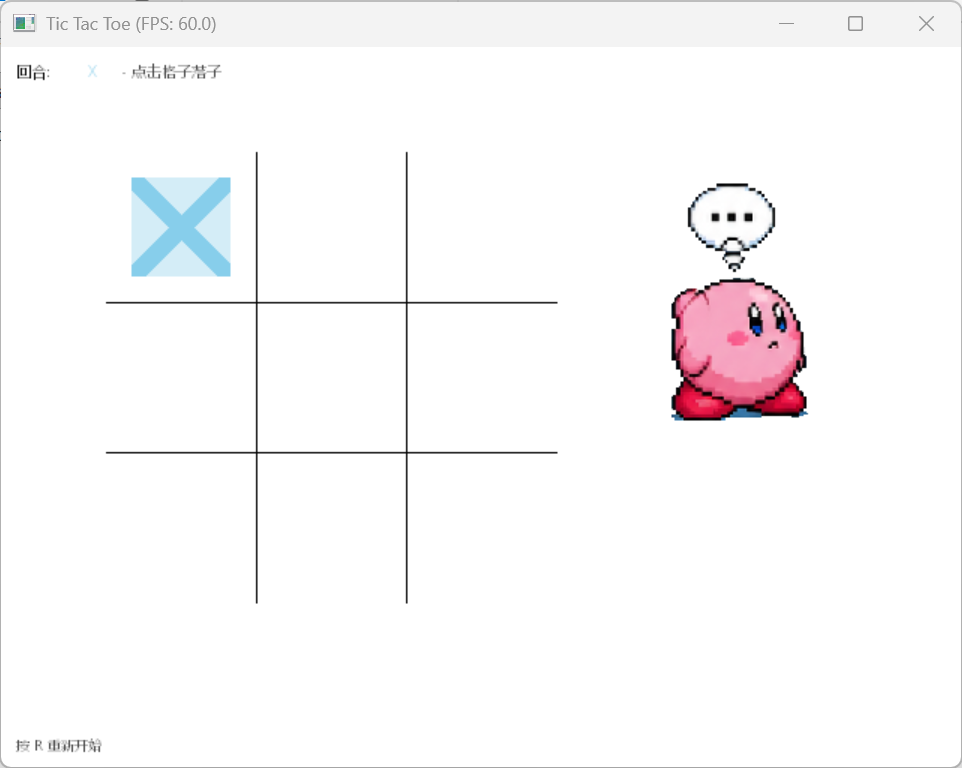
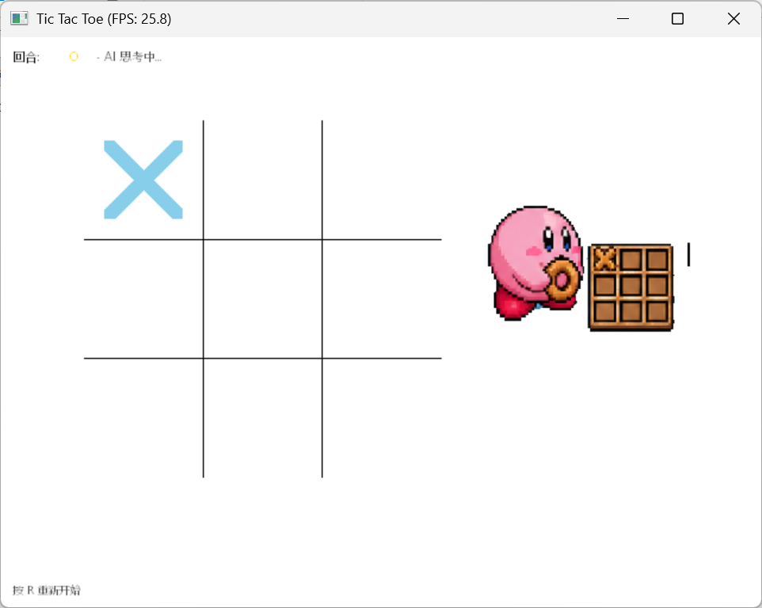
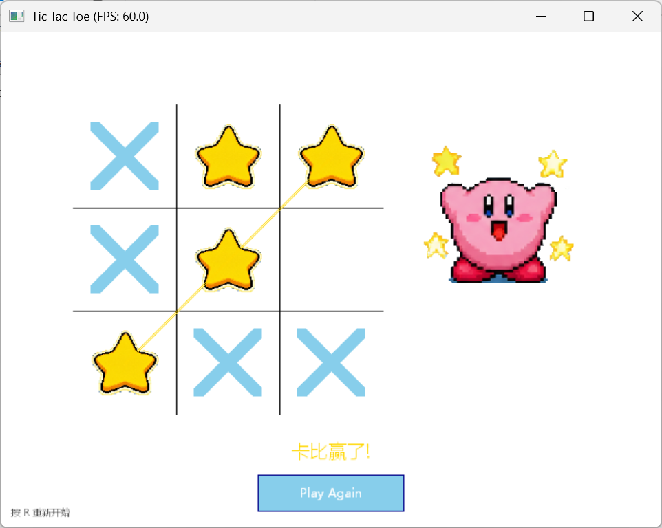

# TicTacToeWin · 星之卡比井字棋

> 一款基于 **Win32 GDI** 的 C++ 井字棋小游戏，玩家执 ✕ 对战搭载 **Minimax** 算法的 AI 卡比 ⭐，全程 60 FPS，附带像素风角色动画与开场 / 胜利画面。
>
> 图形部分基于开源单头文件游戏库 **[GameLib](https://github.com/skywind3000/GameLib)**（MIT License，Copyright © 2026 skywind3000 / Lin Wei）。


---

## 目录

- [游戏预览](#游戏预览)
- [特性](#特性)
- [构建与运行](#构建与运行)
- [操作说明](#操作说明)
- [项目结构](#项目结构)
- [资源说明](#资源说明)
- [架构简述](#架构简述)

---

## 游戏预览

### 玩家落子

轮到玩家 ✕ 时，鼠标点击空位即可落子。



### AI 思考中

轮到 AI ⭐ 时，卡比会进入 "思考" 状态。



### AI 胜利

卡比完成三连星，会播放胜利动画并显示「卡比赢了！」。



---

## 特性

- 🎮 **PvE 对战**：玩家执 ✕，卡比 AI 执 ⭐。
- 🧠 **Minimax 算法**：AI 通过经典极小极大搜索做出全局最优决策。
- 🎨 **像素风精灵动画**：`kirby.png` 图集包含「思考 / 落子 / 欢呼 / 沮丧」四个状态共 20 帧，由 `Game::Update` 按 tick 推进。
- 🚀 **开场动画**：`open.png` 全屏淡入展示，再渐变为白屏后进入游戏。
- ⏱️ **AI 落子延迟**：卡比在放置棋子前会先播完整个 "make-move" 动画（5 × 帧延迟），避免瞬时落子破坏节奏。
- 🪟 **Windows GUI 编译**：链接器参数 `-mwindows`，运行无控制台窗口。
- 🔁 **一键重开**：按 `R` 即时重置棋盘与状态机。

---

## 构建与运行

### 环境要求

| 工具                | 说明                        |
| ------------------- | --------------------------- |
| **MinGW-w64 `g++`** | 支持 C++14 的 GCC 编译器    |
| **GNU Make**        | 调用项目根目录的 `Makefile` |
| **Windows OS**      | 依赖 Win32 GDI / GDI+ 渲染  |

> 图形库 **[GameLib](https://github.com/skywind3000/GameLib)**（MIT License）已随仓库内置于 [`lib/GameLib.h`](lib/GameLib.h)，无需额外安装。其所有运行时依赖（Win32 API、GDI+、WinMM 等）均由库自身在运行时动态加载。

### 命令

```bash
make        # 编译生成 output/main.exe
make run    # 编译并启动游戏
make clean  # 删除 build/ 与 output/
```

编译产物位于 `output/main.exe`，属于 Windows GUI 程序，启动时不会弹出控制台。

---

## 操作说明

| 操作                 | 效果                   |
| -------------------- | ---------------------- |
| **鼠标左键点击格子** | 玩家在空格处落 ✕       |
| **R 键**             | 立即重置棋盘，重新开始 |
| **关闭窗口**         | 退出游戏               |

界面左上角显示当前回合（✕ / ⭐）与提示语（"点击格子替子" / "AI 思考中…"），右下角始终提示「按 R 重新开始」。

---

## 项目结构

```
TicTacToeWin/
├── main.cpp              # 入口，定义 GAMELIB_IMPLEMENTATION 后 include GameLib.h
├── Makefile              # 构建脚本（MinGW-w64 GCC，C++14，-mwindows）
├── AGENTS.md             # Agent 协作说明
├── src/
│   ├── Game.h/.cpp       # 游戏主控：状态机、回合切换、AI 延迟、精灵动画
│   ├── Board.h/.cpp      # 3×3 棋盘、Cell 枚举（EMPTY / X / O）、胜负判定、Move 结构
│   ├── Player.h          # 玩家抽象基类（纯虚 GetMove）
│   ├── HumanPlayer.h/.cpp# 将鼠标坐标转换为 Move
│   └── AIPlayer.h/.cpp   # Minimax AI
├── lib/
│   └── GameLib.h         # 单头文件 Win32 GDI 游戏库（无单独编译）
└── assets/
    ├── images/           # README / 文档用截图
    │   ├── launching.png
    │   ├── place_0.png
    │   ├── place_1.png
    │   └── kirby_win.png
    └── sprites/          # 运行时加载的精灵资源
        ├── kirby.png     # 1330×1182，5 列 × 4 行图集
        ├── open.png      # 开场全屏画面
        └── star.png      # AI 棋子（替代金色圆圈）
```

---

## 资源说明

游戏运行时由 `lib/GameLib.h` 通过 GDI+ 加载以下资源（位于 `assets/sprites/`）：

| 文件        | 尺寸                    | 用途                                                       |
| ----------- | ----------------------- | ---------------------------------------------------------- |
| `open.png`  | 全屏                    | 开场画面，淡入 1 秒后渐白进入游戏                          |
| `kirby.png` | 1330 × 1182（5×4 图集） | AI 对手精灵：行 0=思考 / 行 1=落子 / 行 2=欢呼 / 行 3=沮丧 |
| `star.png`  | 单帧                    | 棋盘上 AI 的棋子（替代默认金色圆圈）                       |

> 图集分块由 `DrawSpriteFrameScaled` + `SPRITE_ALPHA` 渲染；单帧尺寸在运行时通过 PNG 实际尺寸 ÷ (5×4) 计算获得。

`assets/images/` 下的 PNG 则是本 README 使用的演示截图：

| 文件            | 内容          |
| --------------- | ------------- |
| `launching.png` | 开场画面截图  |
| `place_0.png`   | 玩家回合截图  |
| `place_1.png`   | AI 思考中截图 |
| `kirby_win.png` | AI 胜利截图   |

---

## 架构简述

- **无游戏循环框架**：`main.cpp` 直接驱动 `while (!gl.IsClosed()) { ... gl.WaitFrame(60); }`，主循环 60 FPS。
- **多态玩家**：`Game` 持有 `std::unique_ptr<Player>`，X 侧指向 `HumanPlayer`，O 侧指向 `AIPlayer`。
- **状态机**：`Game::Update` 根据 `aiDelay` 推进精灵帧，MAKE_MOVE 动画完整播完后才落子。
- **胜负判定**：`Board` 内部对 8 条获胜线（3 横 + 3 竖 + 2 对角）做同色判定，无胜者且棋满则平局。
- **AI 决策**：`AIPlayer::GetMove` 递归展开未来所有局面，返回评分最高的格子。

---

## 致谢与许可

### GameLib（图形库）

本项目使用 **[GameLib](https://github.com/skywind3000/GameLib)** 作为图形与窗口框架，原作者为 **skywind3000 (Lin Wei)**，遵循 **MIT License** 开放源代码。

- 项目仓库：<https://github.com/skywind3000/GameLib>
- 协议全文：<https://github.com/skywind3000/GameLib/blob/master/LICENSE>
- 本仓库内副本：[`lib/GameLib.h`](lib/GameLib.h)（已随项目打包，保留原始版权头）

依据 MIT 协议要求，使用、复制与修改本软件时须保留原作者的版权声明与许可声明。本项目在此向上述作者致以诚挚感谢。

### 星之卡比素材

`assets/sprites/` 下的像素图集与图标（`kirby.png` / `open.png` / `star.png`）源自星之卡比系列，仅用于 **学习与个人项目演示**，未经任天堂 / HAL Laboratory 授权，不得用于商业用途。如需公开发布衍生作品，请自行替换为自制或已获授权的素材。
